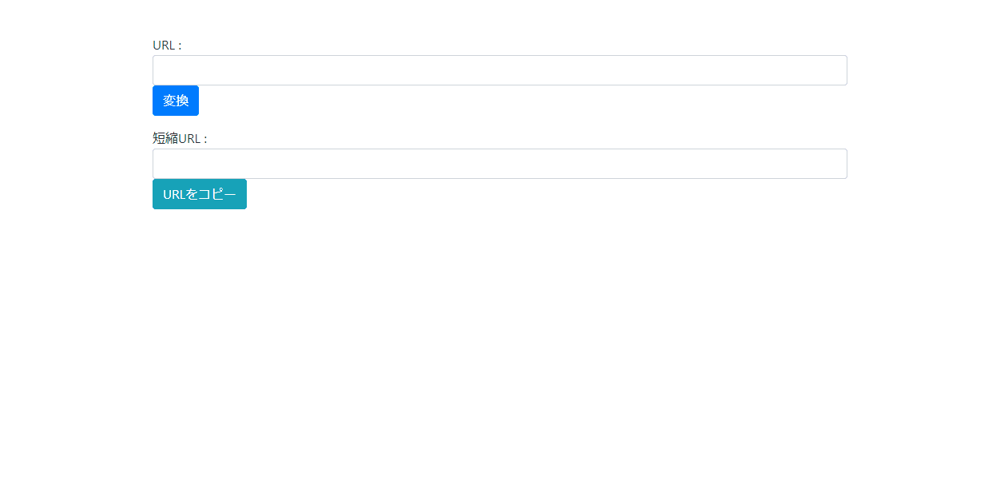
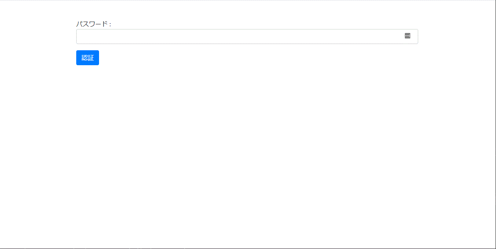

# Url Shorter

This is a library that generates and restores shortened URLs.

[日本語版 ReadMe](docs/Readme_ja.md)

## Requirement

- PHP >= 8.0.0
- Laravel >= 9.0.0

## Functions

- Generate shortened URL
- Restore shortened URL
- Generate short URL from screen(Switchable ON/OFF as an option)
- Generate short URL with API(Switchable ON/OFF as an option)
- Restore short URL with API(Switchable ON/OFF as an option)
- Function that requires password authentication when shortening with screen/API(Switchable ON/OFF as an option)
- Short URL preview function(Switchable ON/OFF as an option)
- Screen/API endpoint change function
- Change the number of random characters in shortened URL
- Change the character type used in the shortened URL

## Quick Start

- Start the console and move to the folder you want to install.

- Install laravel.

```
composer create-project "laravel/laravel" .
```

- Install Url Shorter.

```
composer require hirossyi73/url-shorter
```

- Open ".env" file, input database info.

```
DB_CONNECTION=mysql
DB_HOST=(Host Name)
DB_PORT=(Port Name)
DB_DATABASE=(Database Name)
DB_USERNAME=(User Name)
DB_PASSWORD=(Password)

# To enable the shortened URL function from the screen
URL_SHORTER_ENABLED_WEB_MAKE=true
```

- Enter the following command.

```
php artisan vendor:publish --provider="Hirossyi73\UrlShorter\UrlShorterServiceProvider"
php artisan migrate
```

- Start the server.

```
php artisan serve
```

## Try

- By accessing the following URL, it will transition to the shortened URL generation screen.  
  http(s)://(URL)/make

- Enter the URL and click the "Convert" button.



- You can redirect to the original URL by pasting the generated URL in the browser.

## Password Authentication

Password authentication can be set on the shortened URL generation screen.

- Open the ".env" file and enter the following information.

```
URL_SHORTER_AUTH_USE=true
URL_SHORTER_AUTH_PASSWORD=(Password)
```

- Now, when you access the shortened URL generation screen, you will be prompted for password authentication.



## Preview

- When you enter the shortened URL in the browser, you can display the preview screen without directly redirecting.

- Open the ".env" file and enter the following information.

```
URL_SHORTER_USE_PREVIEW=true
```

- If you enter the shortened URL in your browser, you will be prompted for a preview.


## API

You can use the API.

- Open the ".env" file and enter the following information.

```
URL_SHORTER_ENABLED_API=true #When using original URL recovery from shortened URL
URL_SHORTER_ENABLED_API_MAKE=true #When using shortened URL generation
```

- You can now use the shortened URL API.

### Generate short URL

```
http(s)://(URL)/api/make POST
Content-Type : application/json

POST VALUE:
{
  "url": "(URL to shorten)"
}

RETURN VALUE:
{
  "url": "(URL to shorten)",
  "key": "(Key)",
  "updated_at": "(Updated Datetime)",
  "created_at": "(Created Datetime)",
  "generate_url": "(Generate URL)"
}
```

### Restore from shortened URL

```
http(s)://(URL)/api/g POST
Content-Type : application/json

POST VALUE:
{
  "generate_url": "(Shortened URL)"
}

RETURN VALUE:
{
  "url": "(URL to shorten)",
  "key": "(Key)",
  "updated_at": "(Updated Datetime)",
  "created_at": "(Created Datetime)",
  "generate_url": "(Generate URL)"
}
```

## Setting Value

Add to ".env" file.

#### URL_SHORTER_USE_PREVIEW

When using the preview function, set true(Default : false)

#### URL_SHORTER_AUTH_USE

When password authentication is performed with the shortened URL generation function, set true(Default : false)

#### URL_SHORTER_AUTH_PASSWORD

Password string for password authentication

#### URL_SHORTER_GENERATE_WORDS

Character string used when generating a shortened URL

#### URL_SHORTER_GENERATE_LENGTH

Number of characters when generating a shortened URL

#### URL_SHORTER_GENERATE_CHECK_ALREADY_EXISTS

When true, check existence after creating short keys(Default : true)

#### URL_SHORTER_ENABLED_WEB

If true, use redirect page when accessing shortened URL(Default : true)

#### URL_SHORTER_ENABLED_WEB_MAKE

When true, use shortened URL generation page(Default : false)

#### URL_SHORTER_ENABLED_API

When true, use API to get original URL from shortened URL(Default : false)

#### URL_SHORTER_ENABLED_API_MAKE

When true, use shortened URL generation API(Default : false)
