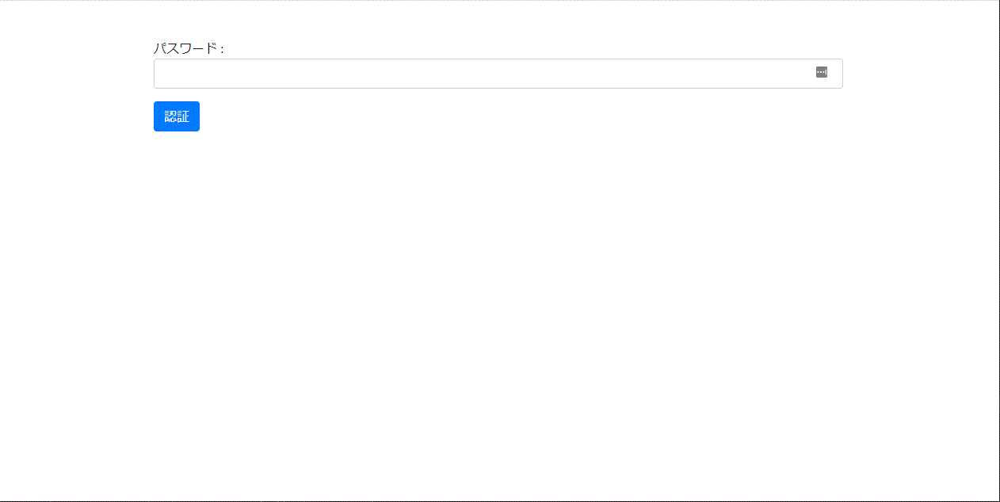

# Url Shorter
短縮URLを生成・復元するライブラリです。  

## 要求
- PHP >= 7.0.0
- Laravel >= 5.5.0

## 機能
- 短縮URLを生成
- 短縮URLを復元
- 画面から短縮URLを生成(オプションでON/OFF切り替え可能)
- APIで短縮URLを生成(オプションでON/OFF切り替え可能)
- APIで短縮URLを復元(オプションでON/OFF切り替え可能)
- 画面・APIで短縮する場合に、パスワード認証を求める機能(オプションでON/OFF切り替え可能)
- 短縮URLのプレビュー機能(オプションでON/OFF切り替え可能)
- 画面・APIのエンドポイントの変更機能
- 短縮URLのランダム文字数の変更
- 短縮URLで使用する文字種類の変更


## クイックスタート

- コンソールを起動し、インストールを行いたいフォルダに遷移します。

- laravelをインストールします。
composer create-project "laravel/laravel" .

- ".env"ファイルを開き、データベース情報などを入力します。

```
DB_CONNECTION=mysql
DB_HOST=(ホスト名)
DB_PORT=(ポート番号)
DB_DATABASE=(データベース名)
DB_USERNAME=(ユーザー名)
DB_PASSWORD=(パスワード)

# 画面から短縮URL機能を有効にする場合
URL_SHORTER_ENABLED_WEB_MAKE=true
```

- 画面の言語とタイムゾーンを変更する場合、"config/app.php"を開きます。

```
    'timezone' => 'Asia/Tokyo',

    'locale' => 'ja',
```


- 以下のコマンドを入力します。

```
php artisan vendor:publish --provider="Hirossyi73\UrlShorter\UrlShorterServiceProvider"
php artisan migrate
```

- サーバーを起動します。

```
php artisan serve
```

## 試す

- 以下のURLにアクセスすることで、短縮URL生成画面に遷移します。  
http(s)://(URL)/make

- URLを入力し、「変換」ボタンをクリックします。


- 生成URLをブラウザに貼り付けることで、元のURLにリダイレクトします。

## パスワード認証
短縮URL生成画面に、パスワード認証を設定することができます。

- ".env"ファイルを開き、以下の情報を入力します。

```
URL_SHORTER_AUTH_USE=true
URL_SHORTER_AUTH_PASSWORD=(パスワード)
```

- これで、短縮URL生成画面にアクセスすると、パスワード認証を求められるようになります。



## プレビュー機能
- 短縮URLをブラウザで入力した際に、直接リダイレクトせず、プレビュー画面を表示することができます。 

- ".env"ファイルを開き、以下の情報を入力します。

```
URL_SHORTER_USE_PREVIEW=true
```

- これで、短縮URLをブラウザに入力すると、プレビューが求められます。


## API
APIを使用することができます。

- ".env"ファイルを開き、以下の情報を入力します。

```
URL_SHORTER_ENABLED_API=true #短縮URLから元のURL復元を利用する場合
URL_SHORTER_ENABLED_API_MAKE=true #短縮URL生成を利用する場合
```

- これで、短縮URLのAPIを利用できます。


### 短縮URL生成

```
http(s)://(URL)/api/make POST
Content-Type : application/json

POST値：
{
  "url": "(短縮したいURL)"
}

戻り値：
{
  "url": "(短縮したいURL)",
  "key": "(キー)",
  "updated_at": "(更新日時)",
  "created_at": "(作成日時)",
  "generate_url": "(短縮URL)"
}
```

### 短縮URLから復元

```
http(s)://(URL)/api/g POST
Content-Type : application/json

POST値：
{
  "generate_url": "(短縮後のURL)"
}

戻り値：
{
  "url": "(元のURL)",
  "key": "(キー)",
  "updated_at": "(更新日時)",
  "created_at": "(作成日時)",
  "generate_url": "(短縮後のURL)"
}
```